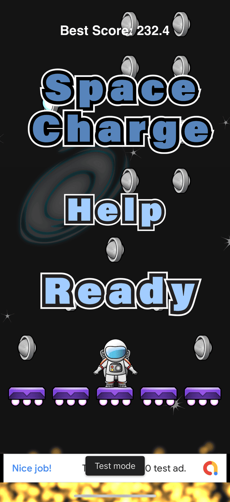
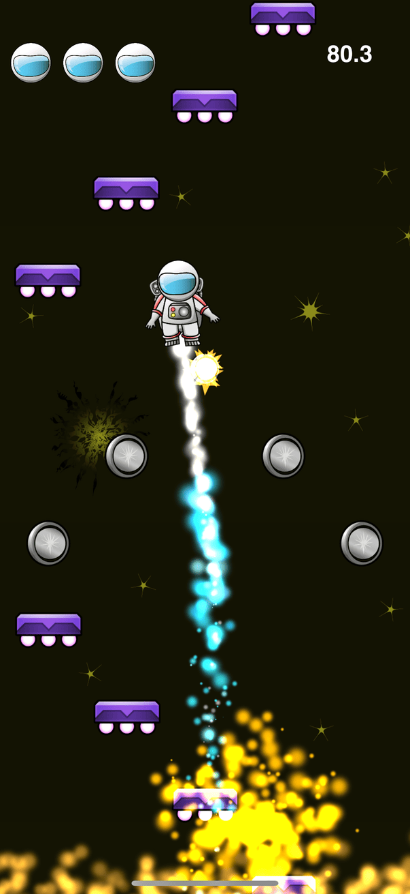
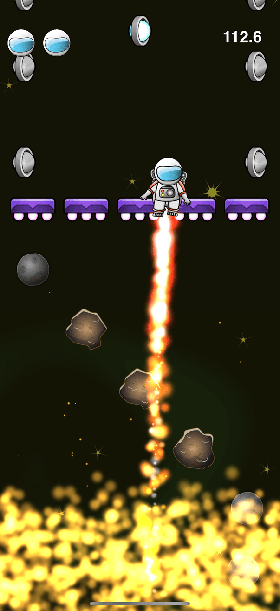

# Space Charge

[](LICENSE)

A fast-paced, vertical platformer iOS game built with SpriteKit. Jump, dodge, and collect as you ascend through space! 

[](https://apps.apple.com/us/app/space-jumper-squid-adventure/id1516635884)

## Table of Contents
- [Space Charge](#space-charge)
  - [Table of Contents](#table-of-contents)
  - [Screenshots](#screenshots)
  - [Features](#features)
  - [Installation](#installation)
  - [Dependencies](#dependencies)
  - [License](#license)
  - [Author](#author)

---

## Screenshots

<p align="center">
  
  
  
</p>

---

## Features
- **Vertical Platformer Gameplay:** Jump from platform to platform, avoid hazards, and collect coins and power-ups.
- **Physics-based Movement:** Responsive controls using device tilt (CoreMotion) and smooth animations.
- **Multiple Game States:** Includes waiting, playing, and game over states.
- **Dynamic Obstacles:** Breakable platforms, lava, bombs, and more.
- **Score Tracking:** Real-time score and best score tracking with persistent storage.
- **Sound & Music:** Engaging sound effects and background music.
- **Ad Integration:** Google Mobile Ads for monetization.
- **Multilingual Support:** Localized for multiple languages using Localize-Swift.

---

## Installation

1. **Clone the repository:**
   ```bash
   git clone https://github.com/banghuazhao/space-charge.git
   cd space-charge
   ```
2. **Install dependencies:**
   Ensure you have [CocoaPods](https://cocoapods.org/) installed, then run:
   ```bash
   pod install
   ```
3. **Open the project:**
   Open `Space Charge.xcworkspace` in Xcode.
4. **Build & Run:**
   Select your target device or simulator and hit Run (▶️) in Xcode.

---

## Dependencies
- [SpriteKit](https://developer.apple.com/spritekit/) (Apple framework)
- [Google-Mobile-Ads-SDK](https://developers.google.com/admob/ios/download)
- [Localize-Swift](https://github.com/malcommac/Localize-Swift)
- [SnapKit](https://github.com/SnapKit/SnapKit)
- [Then](https://github.com/devxoul/Then)
- [SwiftyButton](https://github.com/TakefiveInteractive/SwiftyButton)

All dependencies are managed via CocoaPods (see `Podfile`).

---

## License

This project is licensed under the MIT License. See the [LICENSE](LICENSE) file for details.

---

## Author

[Banghua Zhao](https://github.com/banghuazhao) 